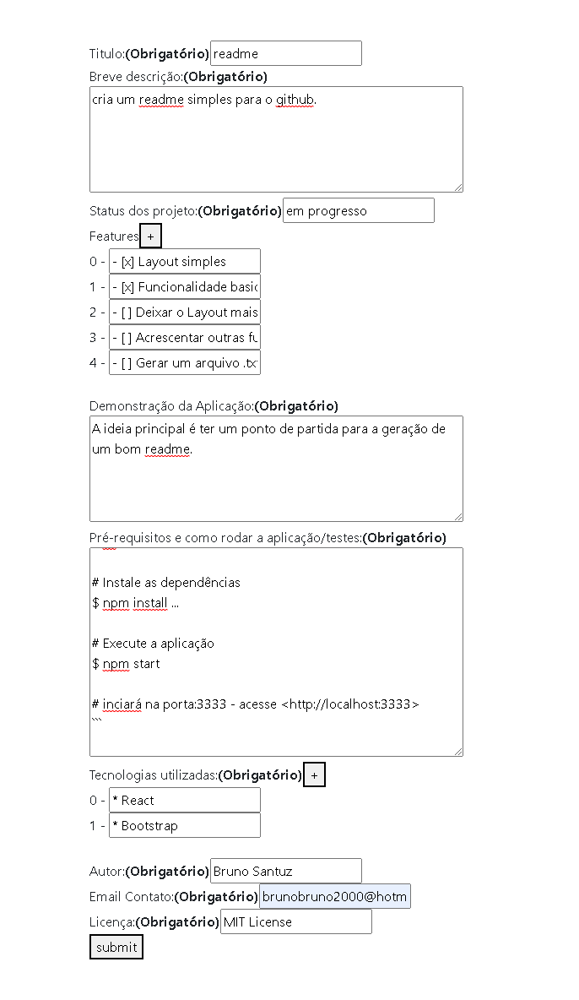

# readme
<p align="center">cria um readme simples para o github.</p>
<h4 align="center"> Status do projeto: em progresso</h4>

### Tabela de conteudo

<p align="center">
<a href="#funcionalidades">funcionalidades</a> • 
<a href="#Demostração-da-Aplicação">Demostração</a> • 
<a href="#Como-executar-o-projeto">como Executar</a> • 
<a href="#Tecnologias-utilizadas">Tecnologias</a> •   
<a href="#autor">Autor</a> •
<a href="#licença">Licença</a> 
</p>

### funcionalidades
- [x] Layout simples
- [x] Funcionalidade basica
- [ ] Deixar o Layout mais amigavel
- [ ] Acrescentar outras funcionalidades
- [ ] Gerar um arquivo .txt 
- [ ] uma opção de salvar para poder acrescentar ou reeditar mais facil

### Demostração da Aplicação
A ideia principal é ter um ponto de partida para a geração de um bom readme.
\n!O README SAI NO LOG DO NAVEGADOR!(temporario)
\n[Link para ver funcionando](https://resplendent-pothos-70778f.netlify.app/)



### Como executar o projeto


Antes de começar, você vai precisar ter instalado em sua máquina um editor para trabalhar com o código como [VSCode](https://code.visualstudio.com/)

```bash
# Acesse a pasta do projeto no terminal/cmd
$ cd ...

# Instale as dependências
$ npm install ...

# Execute a aplicação 
$ npm start

# inciará na porta:3333 - acesse <http://localhost:3333>
```
            
### Tecnologias utilizadas
* React
* Bootstrap

### Autor
Feito com ❤️ por Bruno Santuz 👋🏽 Entre em contato!
email: brunobruno2000@hotmail.com

### Licença
MIT License
